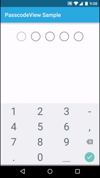

# PasscodeView
[](https://www.apache.org/licenses/LICENSE-2.0)
[  ](https://bintray.com/iammehedi/Maven/online.devliving%3Apasscodeview/_latestVersion)

An android widget to input passcode.

## Setup
### Maven
```xml
<dependency>
  <groupId>online.devliving</groupId>
  <artifactId>passcodeview</artifactId>
  <version>1.0.3</version>
  <type>pom</type>
</dependency>
```
### Gradle
```groovy
compile 'online.devliving:passcodeview:1.0.3'
```

## Usage
`PasscodeView` is a `ViewGroup` subclass. So it can easily be added in any xml layout file.

```xml
<online.devliving.passcodeview.PasscodeView
        android:id="@+id/passcode_view"
        android:layout_width="wrap_content"
        android:layout_height="wrap_content"
        android:layout_gravity="center_horizontal"
        passcodeView:numDigits="5"
        android:layout_marginTop="@dimen/activity_vertical_margin"
        />
```

### Methods
- `requestToShowKeyboard()` - Request the PasscodeView to be focused programmatically
- `setText(CharSequence text)` - Set Passcode programmatically
- `clearText()` - Clear Passcode
- `getText()` - get entered Passcode
- `swetError(boolean value)` - set the error state of view
- `setPasscodeEntryListener(PasscodeEntryListener mPasscodeEntryListener)` - Set a listener to get notified when the Passcode has been entered

### Listener:`PasscodeEntryListener`
- `onPasscodeDigitEntered()` - Called when a digit of the passcode has been entered
- `onPasscodeEntered(String passcode)` - Called when all the digits of the passcode has been entered

```java
passcodeView.setPasscodeEntryListener(new PasscodeView.PasscodeEntryListener() {
            @Override
            public void onPasscodeDigitEntered() {
                // Next digit of the passcode was entered
            }

            @Override
            public void onPasscodeEntered(String passcode) {
                Toast.makeText(SampleActivity.this, "Passcode entered: " + passcode, Toast.LENGTH_SHORT).show();
            }
        });
```

### XML Attributes
- `numDigits` - Number of passcode digits
- `masked` - If digits should be masked or not, `true` by default
- `digitTextSize` - Size of the digits if fields are not masked, `14sp` by default
- `digitElevation` - Elevation of each digit, only applicable for OS version >= Lollipop
- `digitRadius` - radius for digit circle `16dip` by default
- `digitInnerRadius` - radius for digit inner circle `10dip` by default
- `controlColor` - color of the outer circle in normal state, by default `android:colorControlNormal`
- `controlColorActivated` - color of outer circle when focused, by default `android:colorControlHighlighted`
- `controlColorError` - color of the outer circle in error state, by default `red`
- `controlFilled` - if control should be fully filled instead of just stroked by default
- `digitColorFilled` - fill color of the inner circle, by default `android:colorPrimary`
- `digitColorBorder` - border color of the inner circle, by default `android:colorPrimaryDark`

## Demo


## License

    Licensed under the Apache License, Version 2.0 (the "License");
    you may not use this file except in compliance with the License.
    You may obtain a copy of the License at

       http://www.apache.org/licenses/LICENSE-2.0

    Unless required by applicable law or agreed to in writing, software
    distributed under the License is distributed on an "AS IS" BASIS,
    WITHOUT WARRANTIES OR CONDITIONS OF ANY KIND, either express or implied.
    See the License for the specific language governing permissions and
    limitations under the License.
